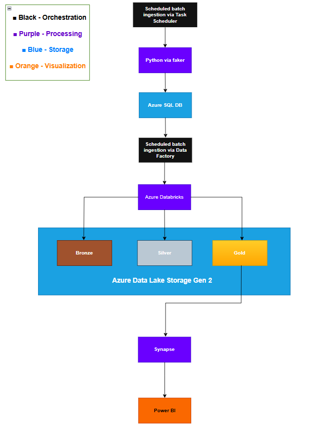

# Project Overview

This project demonstrates a modern batch data pipeline built using the Azure ecosystem. It simulates a real-world data engineering workflow from data generation to visualization, applying the Medallion Architecture (Bronze–Silver–Gold) pattern for data quality and refinement.

## End-to-End Flow

### Data Generation (Processing)
Synthetic data is generated using Python with Faker and ingested into Azure SQL Database on a scheduled basis via Windows Task Scheduler. **Change Data Capture (CDC)** is enabled on the database to track data modifications for incremental processing.

### Data Ingestion (Orchestration)
Azure Data Factory triggers a scheduled batch pipeline that extracts data from Azure SQL DB and loads it into Azure Data Lake Storage Gen2 (Bronze layer).

### Data Transformation (Processing)
Azure Databricks processes and cleans the data:
- **Bronze → Silver**: Data cleansing and standardization
- **Silver → Gold**: Aggregations and business-ready data models

### Data Storage (Storage Layer)
Cleaned and curated data is stored in ADLS Gen2 using the Medallion architecture, enabling scalability and reuse.

### Data Analytics (Visualization)
Processed data is queried in Azure Synapse Analytics and visualized in Power BI dashboards for business insights.

## Architecture

## Key Features
- **Semi-automated batch ingestion** using Task Scheduler and Data Factory (requires user authentication for Task Scheduler execution)
- **Change Data Capture (CDC)** enabled on Azure SQL DB for efficient incremental data tracking
- Modular **Medallion architecture** (Bronze, Silver, Gold) for progressive data refinement
- Scalable and cloud-native design leveraging Azure Databricks and ADLS Gen2
- Synthetic data generation using Faker (no real data used)
- End-to-end integration from ingestion through analytics
- Business-ready dashboard in Power BI

## Tech Stack

| Layer | Technology |
|-------|-----------|
| **Orchestration** | Windows Task Scheduler, Azure Data Factory |
| **Processing** | Python (Faker), Azure Databricks, Azure Synapse Analytics |
| **Storage** | Azure SQL Database (with CDC), Azure Data Lake Storage Gen2 |
| **Visualization** | Power BI |

## Notes
- Change Data Capture configured via SSMS for incremental data processing capabilities
- Task Scheduler requires user authentication to execute the Python data generation script
- Power BI refresh requires manual trigger or can be automated with Power BI Pro/Premium
- The core Azure pipeline (Data Factory → Databricks → Synapse) runs fully automated once triggered
