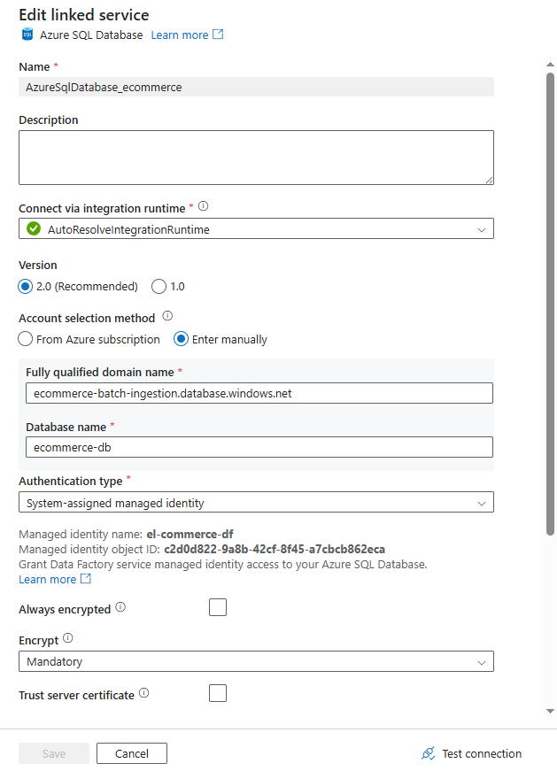
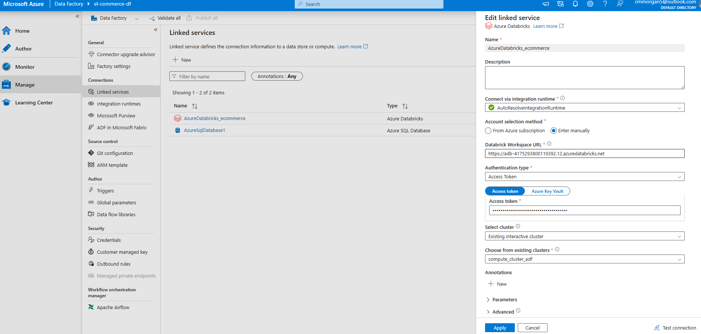
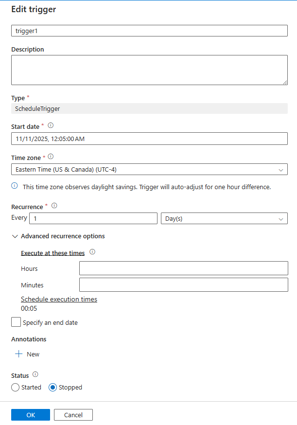
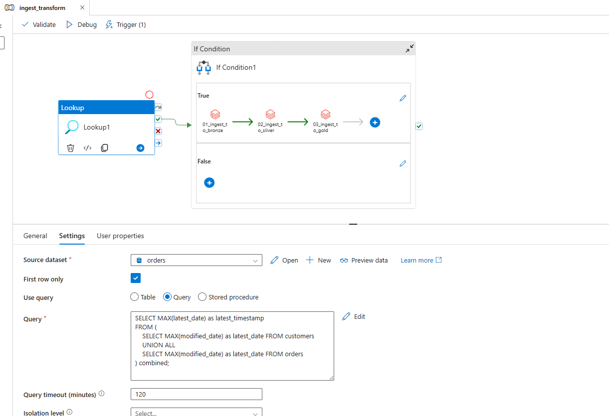
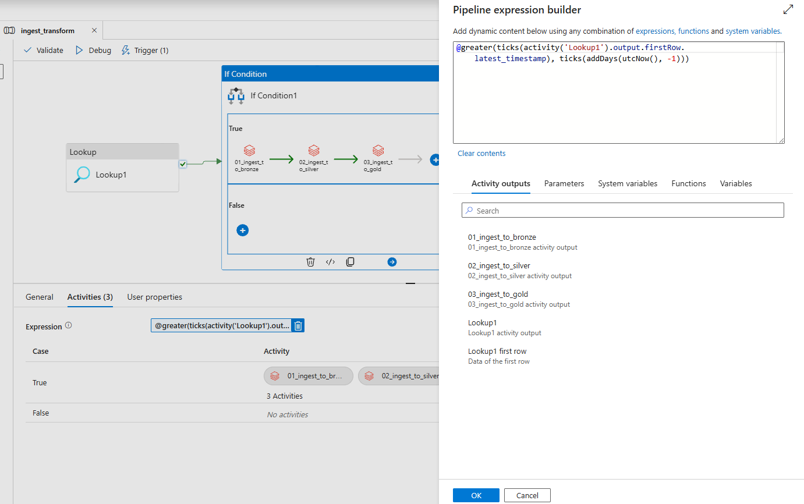

# Azure Data Factory Pipeline
## Linked Services
### Azure SQL Database

Connects to the ecommerce-db database where CDC is enabled. Uses system-assigned managed identity for authentication.
### Azure Databricks

Connects to the Databricks workspace that runs transformation notebooks and writes data to ADLS (Bronze, Silver, Gold layers).

## Pipeline: `ingest_transform`
### Trigger Configuration

Scheduled to run daily at 12:05 AM Eastern Time. Checks for new data and processes it through the medallion architecture.
### Lookup Activity

Queries the database to find the latest timestamp from customers and orders tables. This determines if new data exists to process.
### If Condition & Pipeline Flow

If new data is detected (timestamp within last 24 hours), the pipeline runs three Databricks notebooks in sequence:

- `01_ingest_to_bronze` - Raw data ingestion

- `02_ingest_to_silver` - Data cleansing and transformation

- `03_ingest_to_gold` - Business-level aggregations
