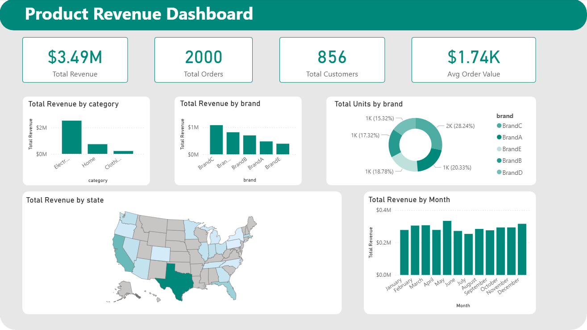

# Power BI Dashboard

## Overview
Product revenue dashboard analyzing $3.49M in sales across 2000 orders from 856 customers.

## Key Features
- **KPI Cards**: Total Revenue, Orders, Customers, Avg Order Value
- **Category Analysis**: Revenue breakdown by product category
- **Brand Performance**: Revenue and unit distribution across brands
- **Geographic Distribution**: State-level revenue visualization
- **Trend Analysis**: Monthly revenue patterns

## Data Source
- **Connection**: Azure Synapse SQL Pool
- **View**: `vs_Sales`

## File
Open `ecommerce-dashboard.pbix` in Power BI Desktop to explore the interactive dashboard.
