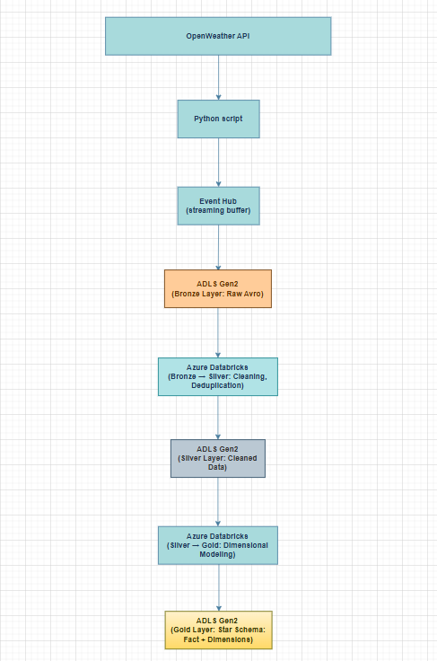

## Weather Streaming ETL Pipeline
Developed a real-time ETL pipeline to continuously process weather data for multiple cities using Python and Azure services. The pipeline automatically extracts current weather data every five minutes from the OpenWeather API, streams it through Azure Event Hubs, and loads it into **Azure Data Lake Storage (ADLS)**. Data is then transformed in **Azure Databricks** using **PySpark**, following the **Medallion Architecture** (Bronze, Silver, Gold layers) with orchestrated Databricks **Jobs**. Applied dimensional modeling techniques to create a **star schema** optimized for analytics.

## Key Features
- Real-time data ingestion with scheduled extraction intervals
- Scalable stream processing using Azure Event Hubs
- Medallion Architecture (Bronze → Silver → Gold)
- Orchestrated pipeline execution with Databricks Jobs
- Star schema dimensional model with weather fact table and supporting dimension tables (location, conditions, time, collection)

## Architecture

## Tech Stack
- **Python** (Jupyter Notebooks, `requests`, PySpark)
- **Azure Event Hubs**
- **Azure Databricks** (Jobs, Medallion Architecture)
- **Azure Data Lake Storage** (ADLS)
